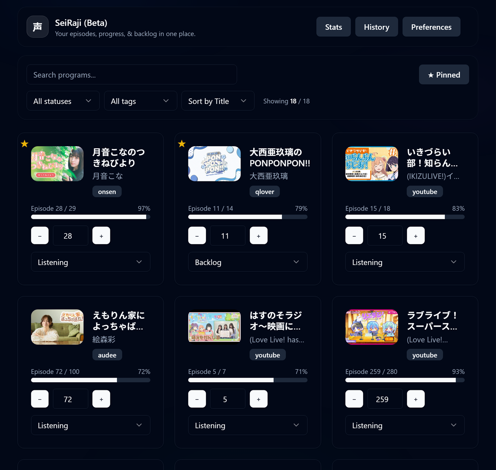
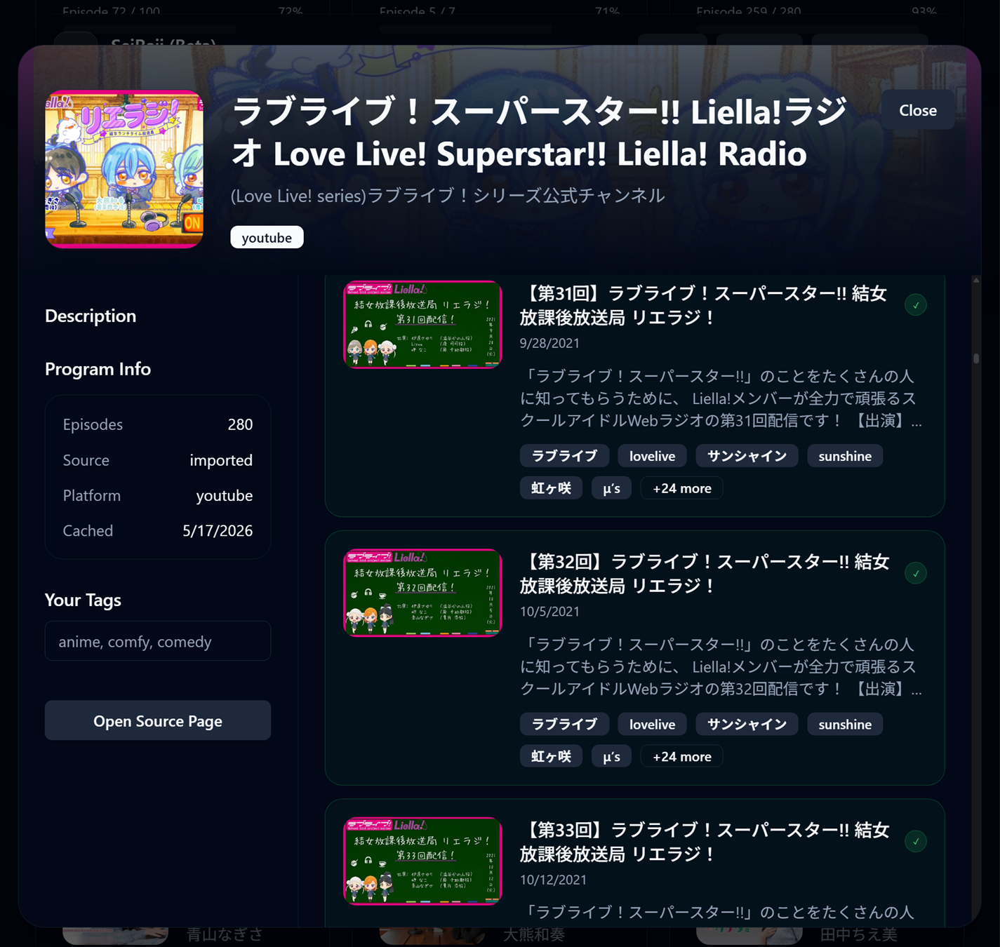
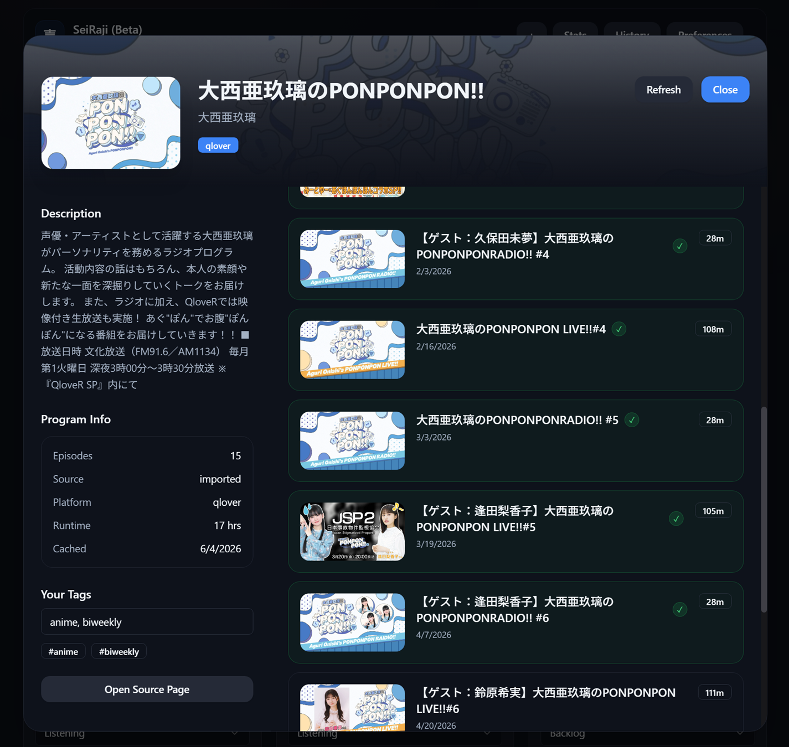
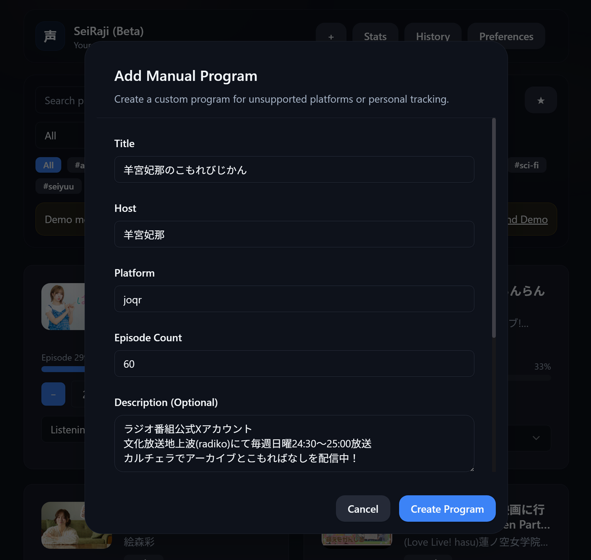
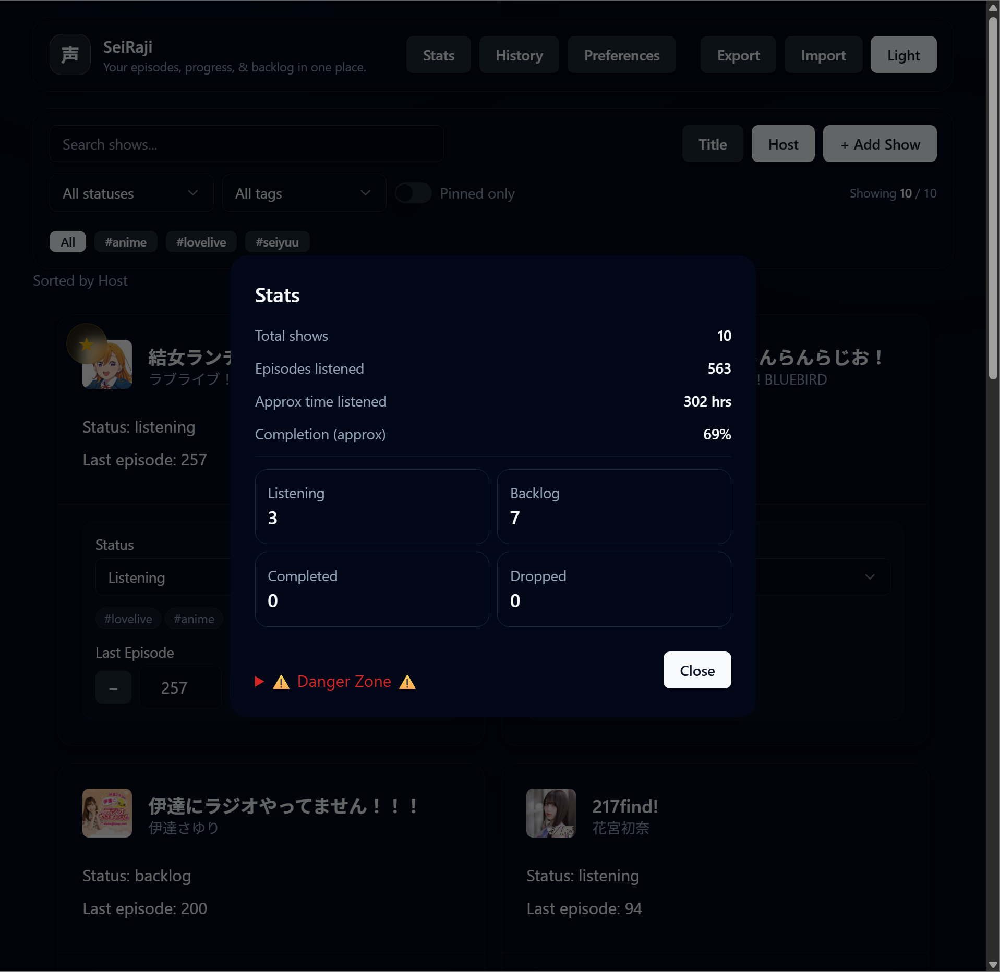
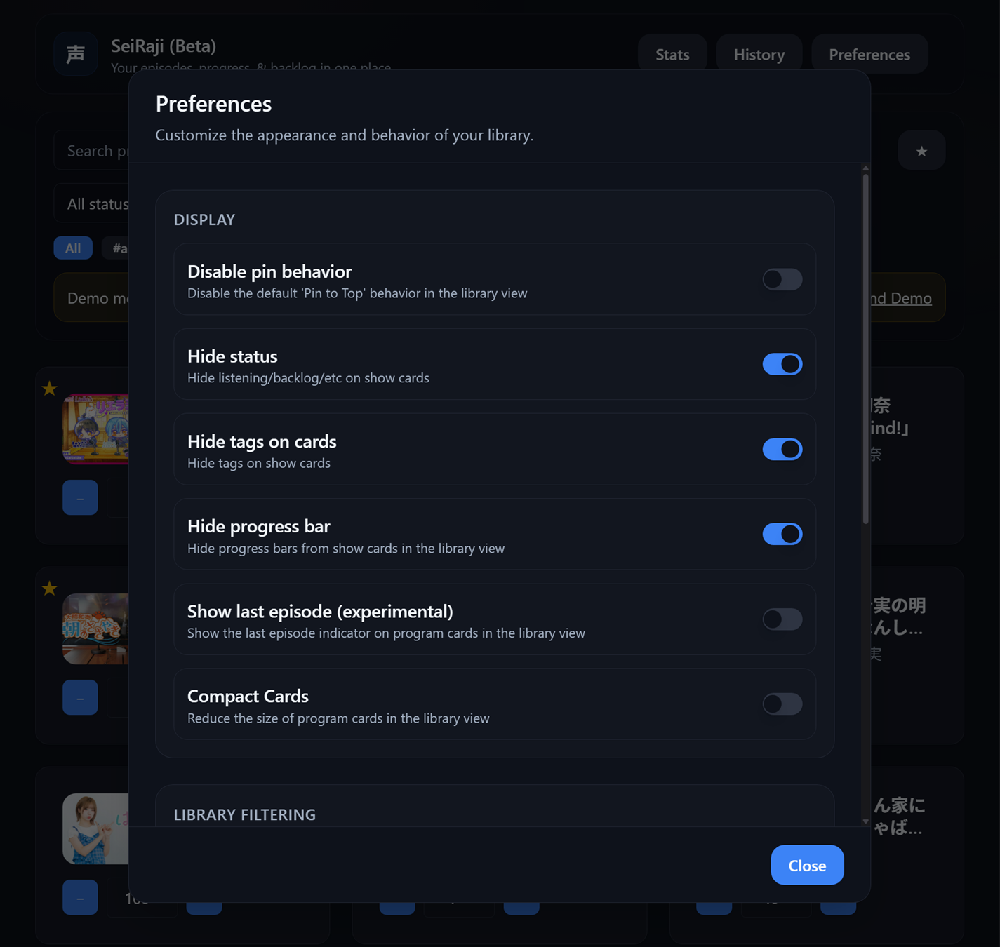
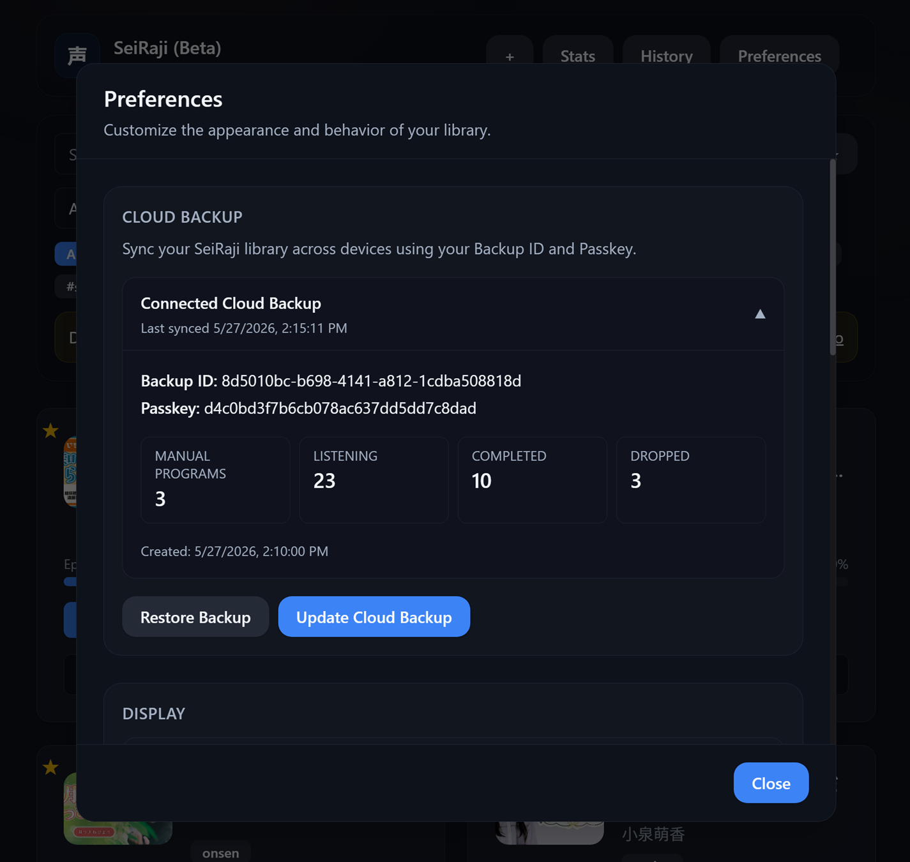
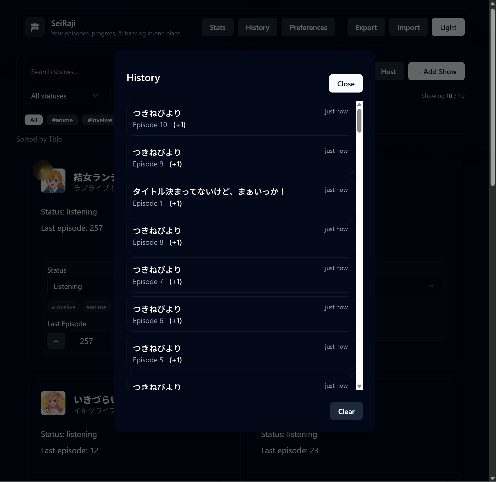

# 声ラジ - SeiRaji (Beta)

SeiRaji is a React + TypeScript web app for tracking Japanese seiyuu radio shows and podcasts across multiple online platforms.

The project started as a personal tool for keeping up with weekly radio programs, but gradually turned into a larger portfolio project focused on state management, responsive UI design, metadata aggregation, and persistent client-side data handling.

Unlike traditional media trackers, SeiRaji is built around Japanese online radio ecosystems like Onsen, AuDee, QloveR, NicoChannel, YouTube playlists, and even supports manually added programs.

Live Demo: https://seiraji.stef-lev.xyz/

## Features

### Library Management

- Track listening progress and program status
- Organize shows into backlog, listening, completed, or dropped categories
- Pin favorite programs to the top of the library
- Add custom tags for organization and filtering
- Manual program creation support for unsupported platforms

### Metadata & Importing

- Automatically import metadata from supported radio platforms
- Support for multiple Japanese streaming/radio services
- Playlist and episodic content support
- Merge imported data with existing local user state

### Backup & Persistence

- Persistent local browser storage
- Cloud backup and restore system
- Cross-device syncing using Backup ID + Passkey credentials
- Activity/history tracking for listening progress

### UI & Customization

- Responsive modal-based UI
- Customizable display preferences
- Filtering and sorting options
- Compact card layouts and optional metadata visibility
- Episode list customization options

## Tech Stack

### Frontend:

- React
- TypeScript
- Vite
- Tailwind CSS
- shadcn/ui
- Framer Motion

### Backend:

- Node.js
- Express
- SQLite3

## Why I Built It

I originally built SeiRaji because there really aren't many dedicated tools for tracking Japanese seiyuu radio content, especially across multiple platforms.

A lot of the project ended up becoming an experiment in building a larger state-heavy frontend application without relying on heavyweight frameworks or external state libraries. Most of the app logic is handled through React hooks, derived state, local persistence layers, and custom utility functions.

The project also gave me experience working with:

- API integration
- local and remote persistence
- responsive UI systems
- TypeScript-heavy component architecture
- modal/state coordination
- data merging and synchronization logic

## Screenshots

### Main Library View

### YouTube Playlist Support

### Support for multiple Japanese online radio platforms (Audee, Onsen, Qlover, NicoChannel, etc.)

### Manual Program Creation

### Stats Modal

### Preferences & Customization

### Cloud Backup & Restore

### Listening History

## Future Plans

- Expanded platform coverage
- Better mobile support
- Optional user accounts/authentication
- Improved backup management
- Native mobile client exploration
- Multi-language support

## License

This project is licensed under the MIT License.

See the [LICENSE](LICENSE) file for details.
