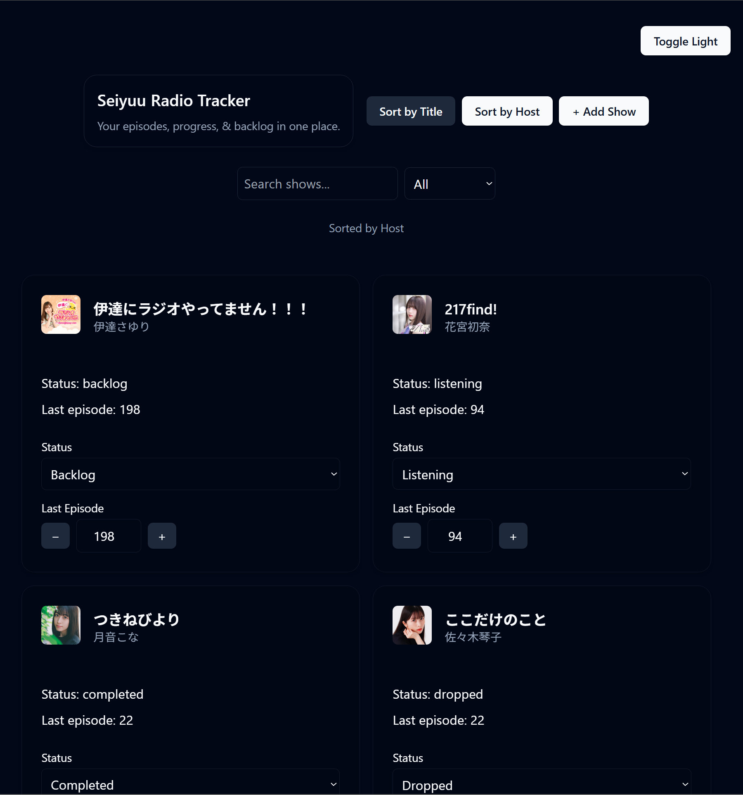
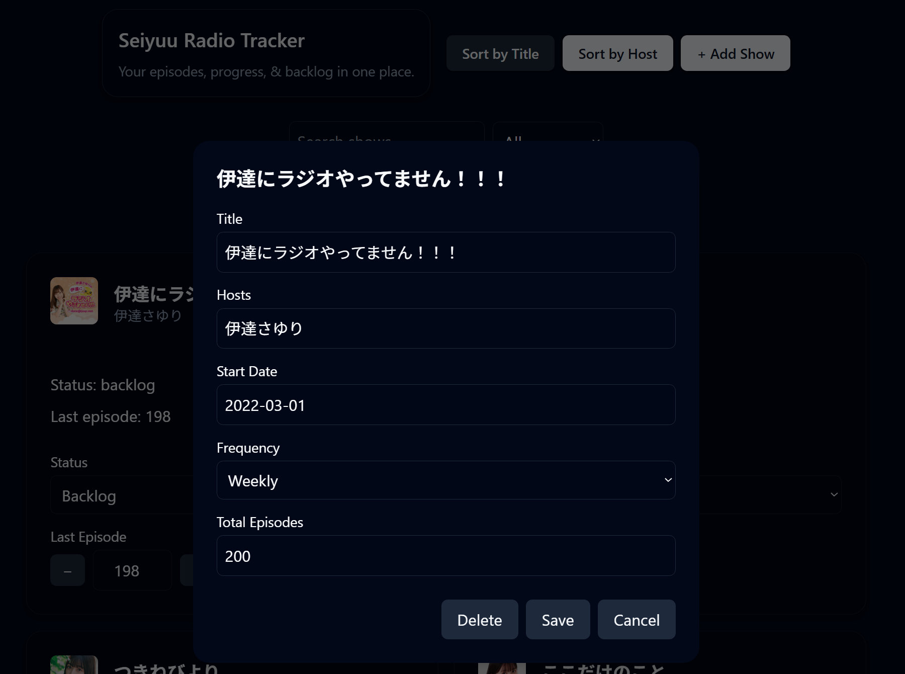

# Seiyuu Radio Tracker

A modern React + TypeScript web app for tracking Japanese seiyuu radio shows, including listening status, episode progress, and personal backlog. All stored locally in the browser.

Built as a portfolio project with a focus on clean state management and a polished, responsive UI.

## Features

- Track radio shows with title, hosts, frequency, and episode count
- Add, edit, and delete shows
- Track listening status
- Search and filter shows

## Tech Stack

- **React** (Vite)
- **TypeScript**
- **Tailwind CSS**
- **shadcn/ui**

## 📸 Screenshots

### Main View

### Edit Show Modal

## License

- MIT
